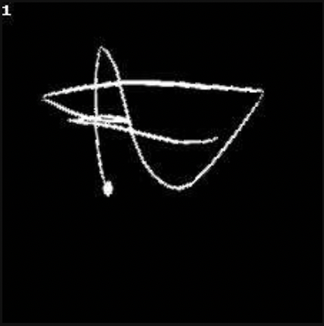
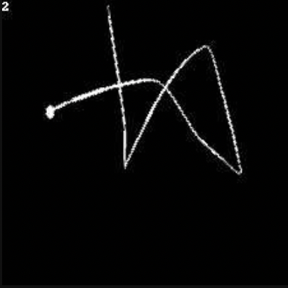
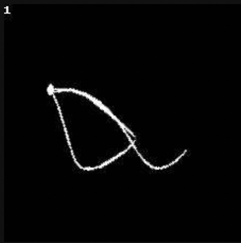
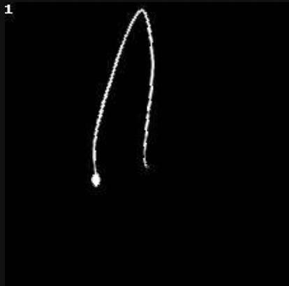

## 2st Place Solution Yandex Cup 2023 - ML NeuroSwipe (Gesture-typing prediction).

Swipe MRR: public 0.8976 / private 0.9064

### Short description of the solution
- Representing swipes as images.
- Training small [TrOCR](https://arxiv.org/abs/2109.10282) model on images and their corresponding words. 
- Using the beam search to get 8 candidates and their score for each swipe.
- Re-ranking results using DTW similarity measure between the user curve and curves generated from the button centers of candidate letters of words.

Example of an input swipe image:






### Requirements:
* python >=3.10
* pdm >= 2.9.2

Model weights and tokenizer can be downloaded from [here](https://drive.google.com/drive/folders/1t0lqMeLRAGuAYKbPD1rOnU0zJ4p3xnIj).
To make the final submission you need to put the files in a /src/model_files/, having previously unzipped the files.

Before running the scripts, change paths in src/constants.py:
- DATA_PATH - files for training and testing should be located in this path.
- IMAGES_PATH - images will be placed in this path.

### Installing dependencies
```sh
cd swipe
pdm install --verbose
```

### Data preprocessing 
```sh
bash bin/data_processing.sh
```

### Training model
```sh
bash bin/train.sh
```

### Make final submission
```sh
bash bin/make_submission.sh
```
